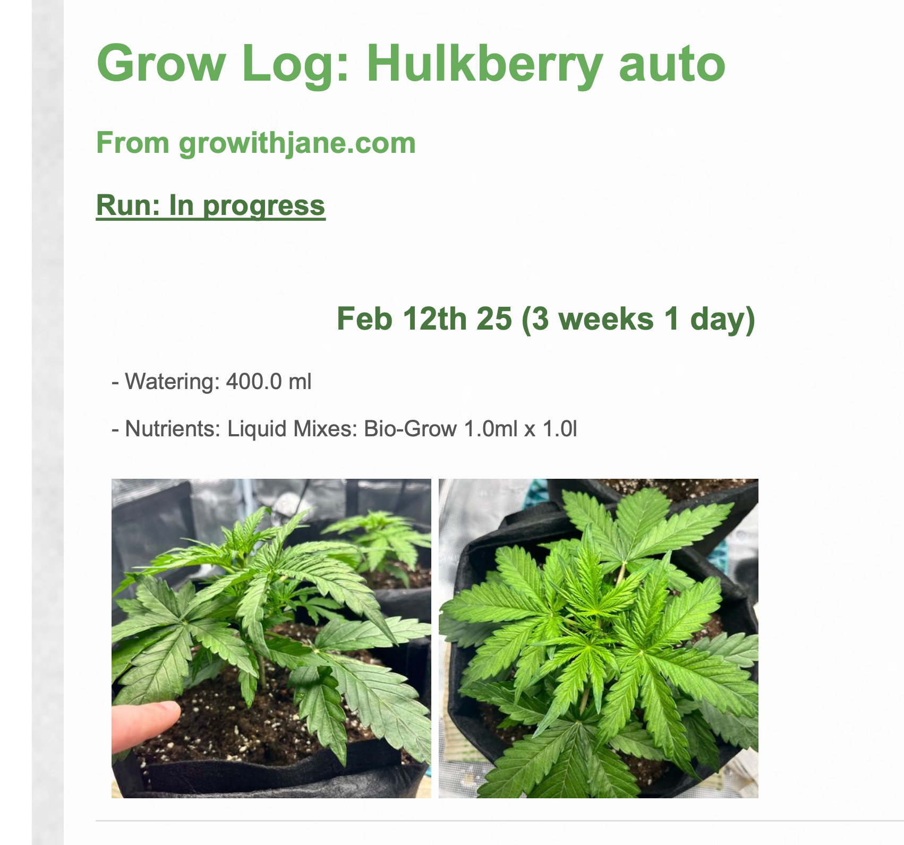

# GrowLog Scraper 🌱

A simple tool to extract your grow logs from GrowWithJane and generate a detailed PDF report and video summary.

## 🚀 Features

- Automatic extraction of your GrowWithJane journal
- Clean PDF generation with your photos and actions
- Video summarizing the growth process
- Progress tracking (germination, growth, etc.)
- Headless mode support (no GUI)
- Complete history of watering and nutrients
- Automatic date and duration formatting

## 📂 Project Structure

```
growithjane-scraper/
├── src/                    # Source code
│   ├── __init__.py        # Package initialization
│   ├── scraper.py         # Web scraping functionality
│   ├── pdf_generator.py   # PDF generation
│   ├── video_generator.py  # Video generation
│   └── utils.py           # Utility functions
├── tests/                  # Test files
│   ├── __init__.py
│   ├── test_scraper.py
│   ├── test_pdf_generator.py
│   └── test_video_generator.py  # New test for video generation
├── docs/                   # Documentation
│   ├── images/
│   │   └── example_report.png
│   └── example.pdf
├── .env.example           # Environment variables template
├── .gitignore             # Git ignore rules
├── LICENSE                # MIT License
├── README.md             # This file
├── requirements.txt      # Python dependencies
└── template.html         # PDF template
```

## 📋 Prerequisites

Before installing the script, make sure you have:

- Python 3.x installed
- Internet access

## 💾 Installation

1. **Clone the repository**
```bash
git clone https://github.com/your-username/growithjane-scraper.git
cd growithjane-scraper
```

2. **Create a virtual environment**
```bash
# On Linux/macOS
python3 -m venv venv
source venv/bin/activate

# On Windows
python -m venv venv
venv\Scripts\activate
```

3. **Install dependencies**
```bash
pip install -r requirements.txt
```

4. **Configuration**
```bash
cp .env.example .env
```

Edit the `.env` file and configure your variables:
```plaintext
# Your GrowWithJane grow log URL
GROWLOG_URL=https://growithjane.com/growlog/growlog-example/
```

**Important note:** 
- Replace `growlog-example` in the URL with your grow log identifier

## 🎯 Usage

### Simple Mode
```bash
python main.py
```

### Verbose Mode (more details)
```bash
python main.py -v
```

### Headless Mode (no browser window)
The script runs in headless mode by default. To show the browser window, modify the `headless` parameter in `main.py`:
```python
browser = await p.chromium.launch(headless=False)
```

The PDF and video will be generated in the current folder with your grow log name.

## 🧪 Running Tests

To run the test suite:
```bash
python -m unittest discover tests
```

## 📸 Output Example

The generated PDF includes:
- A title page with your grow name
- A progress status (In Progress/Completed)
- Journal entries with:
  - Date and grow day
  - Plant state
  - Actions (watering, nutrients, etc.)
  - Progress photos
- A video summarizing the growth process

Example screenshot:


## 🔧 Troubleshooting

### Error: "No module named 'playwright'"
**Solution:**
```bash
pip install -r requirements.txt
playwright install
```

### Error: Browser not found
**Solution:**
Run the Playwright installation command:
```bash
playwright install chromium
```

### Error: "Invalid URL"
**Solution:**
Check that the URL in your `.env` file is correct and accessible. It should look like:
```plaintext
GROWLOG_URL=https://growithjane.com/growlog/your-unique-identifier/
```

## 📄 License

This project is under MIT License. See the [LICENSE](LICENSE) file for more details.
